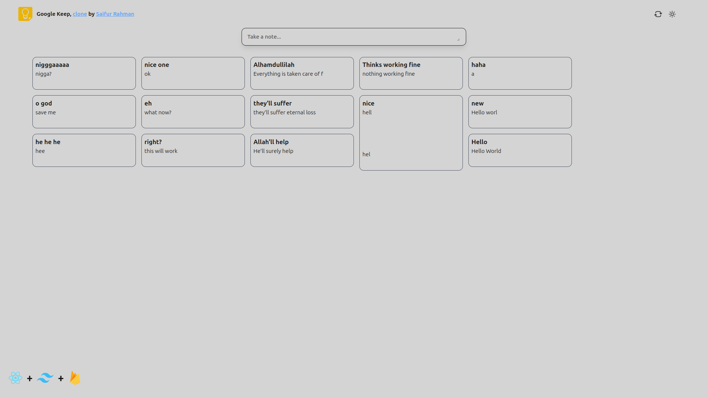

# Google Keep Clone

A simple note-taking app inspired by Google Keep, built with React, Tailwind CSS, and Firebase.


sorry if I blasted your eyes :)

## Table of Contents

- [Overview](#overview)
- [Features](#features)
- [Installation](#installation)
  
## Overview

This project is a Google Keep clone designed to help users take and organize their notes efficiently. It leverages the power of React for the frontend, Tailwind CSS for styling, and Firebase for backend functionalities like real-time data synchronization.

## Features

- **Create and Edit Notes:** Easily create new notes and edit existing ones with a user-friendly interface.
- **Real-time Updates:** Changes to notes are instantly reflected across all devices due to Firebase's real-time synchronization.

## Installation

1. Clone the repository:

   ```bash
   git clone https://github.com/devSaifur/google-keep-clone.git
   ```
